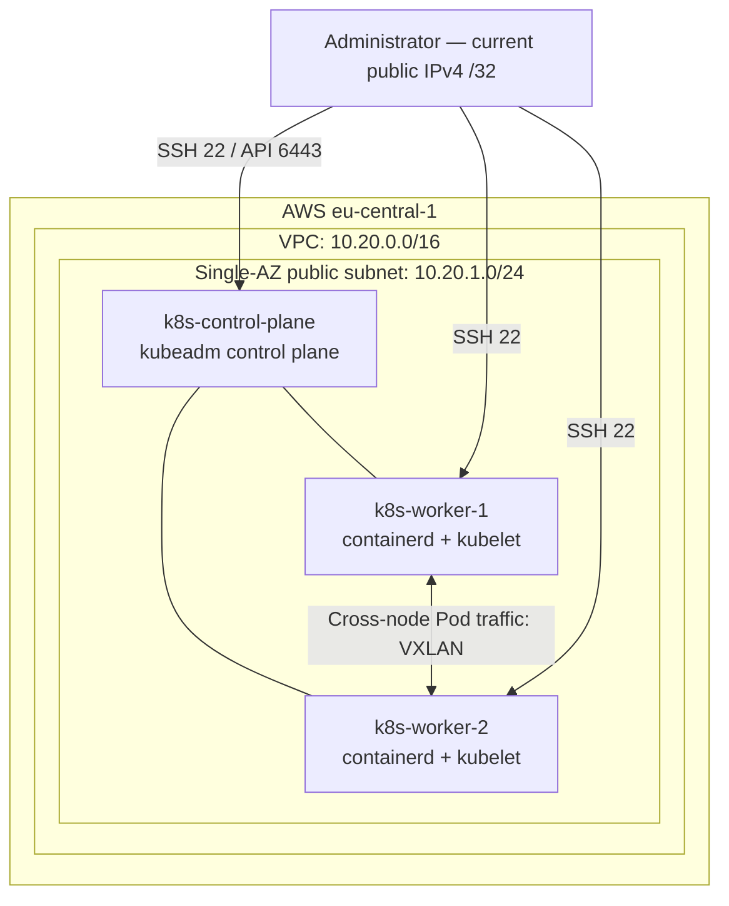

# Cloud-Native Kubernetes Engineering Lab

A self-managed, three-node Kubernetes lab on AWS EC2, built with Terraform,
Ubuntu, containerd and kubeadm. I use it to understand how cloud infrastructure,
Linux and Kubernetes fit together, then test those connections with real workloads.

**Implemented:** AWS infrastructure, Kubernetes bootstrap, Helm-managed Cilium
and cross-node Pod/Service/DNS connectivity. **Next:** Hubble flow observability,
a NetworkPolicy experiment, GitOps with Argo CD, and a lean observability stack.

This is a learning environment, not a production platform or an EKS deployment.

## What this demonstrates

- **Infrastructure as code:** AWS networking, security groups and EC2 nodes in
  Terraform, with remote S3 state and native locking.
- **Self-managed Kubernetes:** kubeadm and containerd on Ubuntu instead of a
  managed control plane.
- **Deliberate networking:** Cilium choices (Kubernetes IPAM, VXLAN, kube-proxy
  retained) kept as Helm values and tested with a cross-node connectivity lab.
- **Cost awareness:** no NAT Gateway, Elastic IP or managed load balancer, and
  nodes are stopped between sessions.
- **Evidence-based documentation:** observed results are kept separate from
  planned work, and a debugging case study follows the evidence layer by layer.

## Start here

- [AWS infrastructure](terraform/infrastructure/) — networking, compute and access controls.
- [Cilium configuration](kubernetes/platform/cilium/values.yml) — explicit IPAM and routing choices.
- [Cross-node networking lab](kubernetes/labs/networking/basic-connectivity.yaml) — client and server pinned to different workers.
- [MySQL OOM investigation](docs/incidents/mysql-5.7-wsl-oom.md) — a separate kind/WSL2 debugging exercise, not an incident on this EC2 cluster.

## Architecture

One control-plane node and two workers share a single public subnet in
`eu-central-1`. Each is a `t3.medium` instance with an encrypted gp3 root volume
(30 GiB by default).

The arrows show access and logical relationships, not every packet-processing
step. A shared security group restricts public SSH/API ingress to the
administrator's `/32`; it permits traffic between cluster members. Nodes reach
the internet through an Internet Gateway. There is no NAT Gateway.

| Network | CIDR | Role |
| --- | --- | --- |
| VPC | `10.20.0.0/16` | AWS node network |
| Public subnet | `10.20.1.0/24` | EC2 nodes |
| Pods | `10.244.0.0/16` | Kubernetes-managed PodCIDRs |
| Services | `10.96.0.0/12` | Virtual Service addresses |

Cilium uses **Kubernetes IPAM, VXLAN tunnelling and the veth datapath**.
kube-proxy is retained; Hubble is disabled in the tracked values.
The network ranges do not overlap.

## Progress and validation

Status reviewed **13 September 2026**. Runtime milestones below reflect previous
lab checks, not a live uptime guarantee; nodes are stopped between sessions.

| Area | Status and evidence |
| --- | --- |
| AWS / Terraform | Infrastructure provisioned; separate S3 state keys for bootstrap and infrastructure, with native S3 locking. |
| Kubernetes | kubeadm bootstrap completed; all three nodes previously observed `Ready`. Latest shared runtime details include Kubernetes `1.36.3` and containerd `2.2.1`. |
| Cilium / Helm | Installed with Helm; the last shared release output reports Cilium `1.20.1`. [Tracked values](kubernetes/platform/cilium/values.yml). |
| Networking | Cross-node ICMP and direct Pod HTTP passed, followed by ClusterIP HTTP and short/FQDN Service-name HTTP. EndpointSlice matched the server Pod. |
| GitOps / observability / recovery | Hubble, Argo CD, k6, Prometheus, Grafana, OpenTelemetry and controlled failure/recovery exercises are planned, not implemented. |

The networking manifest makes the experiment repeatable: a BusyBox client runs
on worker-1, an Nginx server on worker-2, and a ClusterIP Service selects the server.
The observed results validate that path, not comprehensive network-policy
enforcement, performance or availability.

## Engineering decisions

- **kubeadm instead of EKS:** administer the runtime, node bootstrap and control
  plane directly. The trade-off is responsibility for upgrades, recovery and
  host configuration.
- **Terraform for AWS; manual host bootstrap initially:** make infrastructure
  repeatable while learning Linux/runtime configuration. Full cluster rebuilds
  are not yet automated.
- **Helm for Cilium:** keep lab-specific values in Git rather than maintain
  vendor manifests by hand.
- **VXLAN with kube-proxy retained:** establish one working networking baseline
  before experimenting with native routing or service-proxy replacement.
- **Single AZ and one control plane:** fit an intermittent learning workload.
  This deliberately sacrifices high availability.
- **Stop/start operation:** keep compute off during design and documentation.
  EBS storage remains billable; stopping nodes is not a backup strategy.

## Security and state

[Terraform bootstrap](terraform/bootstrap/main.tf) configures S3 versioning,
encryption, public-access blocking, disabled ACLs, an HTTPS-only policy and
Terraform deletion protection. Bootstrap and infrastructure use separate state
keys in the same backend bucket.

[EC2 configuration](terraform/infrastructure/instances.tf) requires IMDSv2,
encrypts root volumes and uses standard CPU credits.
[Security-group rules](terraform/infrastructure/security-groups.tf) allow public
SSH/API access only from `admin_cidr`. There are no public HTTP, HTTPS or
NodePort ingress rules in the tracked configuration.

These are baseline controls, not a claim of production hardening. Cluster-member
traffic and outbound traffic are broadly allowed. Root volumes survive normal
stop/start, but are configured for deletion on instance termination.

## Debugging and operational lessons

**Dynamic administrator IP.** SSH timed out after both EC2 public addresses and
the residential administrator address changed. Updating the SSH destination alone
was insufficient: the security group still allowed the old source `/32`.
The fix was to update `admin_cidr` in local Terraform inputs and apply the
reviewed security-group change, without opening SSH to the internet.

**DNS output versus application behavior.** BusyBox `nslookup` returned a valid
Service answer alongside `NXDOMAIN` responses for other search-suffix candidates.
Short-name and fully qualified HTTP requests both succeeded. The lesson was to
test the actual application path rather than diagnose DNS failure from one exit
code alone.

**MySQL OOM on kind/WSL2 — 28 August 2026.** The
[incident note](docs/incidents/mysql-5.7-wsl-oom.md) follows the investigation from
Kubernetes `OOMKilled` through host/container limits to kernel `global_oom`
evidence. This happened in a separate local environment; it is included as a
debugging case study, not cloud-cluster validation.

## Working with this repository

This is not yet a one-command cluster installer. Terraform provisions AWS
resources; Linux preparation and kubeadm bootstrap were performed manually.

For a separate deployment, review the account-specific S3 backend settings in
both Terraform roots and provide your own inputs using
[terraform.tfvars.example](terraform/infrastructure/terraform.tfvars.example).
Do not reuse another account's backend or commit credentials, private keys,
kubeconfigs or populated variable files.

Review plans and diffs before applying changes. Repository collaboration and
approval rules are documented in [AGENTS.md](AGENTS.md).

## Next milestones

1. Enable Hubble through the tracked Cilium values, without changing the
   Cilium version or routing model, and observe flows in the networking lab.
2. Run a deliberate NetworkPolicy before-and-after experiment and observe both
   allowed and dropped traffic.
3. Introduce Argo CD so that platform components are deployed from this
   repository.
4. Add a lean observability stack (OpenTelemetry, Prometheus, Grafana, Tempo)
   with small AI-agent workloads to observe, then introduce controlled
   failures and document symptoms, recovery and limitations.

Backup/restore validation and CI remain future work. New tooling is introduced
when it supports a concrete experiment, not simply to expand the stack.
