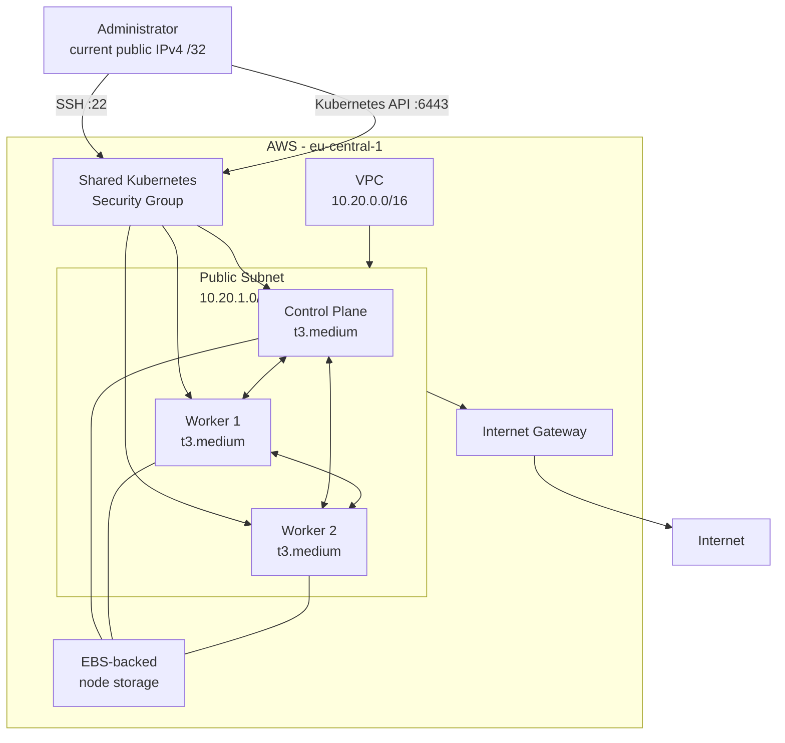

# Cloud-Native Kubernetes Engineering Lab

> A long-running, hands-on platform engineering lab for learning Kubernetes from the Linux and cloud infrastructure layers upward.

This project is a self-managed Kubernetes environment built on AWS EC2 using **Terraform, Ubuntu Server, containerd, and kubeadm**.

The goal is not simply to get Kubernetes running. The lab is designed to progressively develop practical skills across:

- Linux and container internals
- AWS cloud infrastructure
- Terraform and Infrastructure as Code
- Kubernetes administration
- networking and eBPF with Cilium
- observability and incident response
- storage and stateful workloads
- security and policy enforcement
- Helm and package lifecycle management
- CI/CD and GitOps
- FinOps and cloud cost optimization
- platform engineering
- eventually multi-cloud operation and migration

The cluster is intentionally built manually at the lower layers before introducing higher-level automation.

---

## Progressive Engineering Education

The central design philosophy of this project is:

> **Understand the underlying layer first → inspect what an abstraction does → adopt the abstraction when manual work starts having diminishing educational returns.**

This means the project does not optimize purely for the fastest installation path.

For example:

- Linux networking and container runtime fundamentals are learned before Kubernetes abstractions.
- `kubeadm` is used instead of immediately adopting a fully managed Kubernetes service.
- Kubernetes resources for the first custom application will be written manually before converting them into a Helm chart.
- Complex third-party software such as Cilium will be managed with Helm, but only after its networking architecture is understood and the generated Kubernetes manifests are inspected.
- Repetitive host configuration will eventually move toward tools such as Ansible rather than remaining a collection of manual SSH commands.
- GitOps will be introduced only after manual Kubernetes and Helm workflows are understood.

The purpose is to understand **what the abstraction removes**, rather than allowing tools to become black boxes.

---

# Architecture



### Cluster networking

| Network | CIDR | Purpose |
|---|---|---|
| AWS VPC | `10.20.0.0/16` | EC2/node networking |
| Public subnet | `10.20.1.0/24` | Kubernetes EC2 nodes |
| Kubernetes Pods | `10.244.0.0/16` | Pod IP allocation |
| Kubernetes Services | `10.96.0.0/12` | Virtual Service IPs |

The ranges are intentionally non-overlapping.

The future Cilium configuration will also avoid its default `10.0.0.0/8` cluster-pool because that range would overlap with the AWS VPC.

---

# Current Cluster

The current environment consists of:

```text
1 × Kubernetes control-plane node
2 × Kubernetes worker nodes

Instance type: t3.medium
Operating system: Ubuntu Server
Container runtime: containerd
Cluster bootstrap: kubeadm
Region: eu-central-1
Availability model: Single AZ
```

### Current state

```text
AWS networking               ✅
Terraform remote state       ✅
Security groups              ✅
EC2 nodes                    ✅
Linux host preparation       ✅
containerd + runc            ✅
Kubernetes packages          ✅
Control plane initialized    ✅
Workers joined               ✅
Kubernetes API healthy       ✅

CNI / Cilium                 ⏳ Next
Nodes Ready                  ⏳ Waiting for CNI
CoreDNS networking           ⏳ Waiting for CNI
Helm                         ⏳ Planned next
Hubble                       ⏳ Planned
Observability stack          ⏳ Planned
GitOps                       ⏳ Planned
Persistent applications      ⏳ Planned
```

The current `NotReady` state before installing a CNI is expected rather than considered a failure.

---

# Terraform and AWS Infrastructure

Terraform is used to manage the AWS infrastructure.

The lab currently provisions and manages:

- VPC
- public subnet
- Internet Gateway
- route table
- Kubernetes node security group
- EC2 instances
- node-related outputs

Terraform state is stored remotely in Amazon S3 rather than only on the local machine.

Separate state keys are used for:

```text
bootstrap/terraform.tfstate
infrastructure/terraform.tfstate
```

The backend includes:

- S3 versioning
- server-side encryption
- public access blocking
- ACLs disabled
- HTTPS-only bucket policy
- deletion protection
- native S3 state locking

This prevents the infrastructure lifecycle from depending on a single local `terraform.tfstate` file.

---

# Security Model

The initial network security model intentionally exposes as little as possible.

### Public ingress

```text
TCP 22   SSH
         Source: administrator's current public IPv4 /32

TCP 6443 Kubernetes API
         Source: administrator's current public IPv4 /32
```

### Cluster-internal traffic

All nodes share a Kubernetes security group.

Traffic between members of that security group is permitted so Kubernetes components and the future CNI can communicate across nodes.

### Not publicly exposed

The following are intentionally **not** publicly opened yet:

```text
HTTP 80
HTTPS 443
NodePort 30000-32767
application workloads
Grafana
Prometheus
```

These will only be exposed later through deliberate ingress, TLS, and authentication decisions.

---

# Operational Lesson: Dynamic Public IPv4

One useful real-world failure occurred after the cluster had been stopped for several days.

Both:

- the automatically assigned EC2 public IP addresses, and
- the administrator's residential public IPv4

had changed.

MobaXterm SSH sessions were updated with the new EC2 addresses, but connections still timed out.

The cause was the security-group rule:

```text
SSH 22   → old administrator IPv4 /32
API 6443 → old administrator IPv4 /32
```

The new residential address was therefore correctly rejected.

The fix was to update:

```hcl
admin_ipv4_cidr = "<current-public-ip>/32"
```

and reapply the security-group configuration through Terraform.

### Lesson

This demonstrated the trade-off between **least-privilege networking** and operational convenience.

Allowing:

```text
0.0.0.0/0 → SSH
```

would have avoided the problem but unnecessarily exposed the SSH daemon to the entire IPv4 internet.

A more mature environment would normally use mechanisms such as:

- private networking
- VPN access
- bastion hosts
- AWS Systems Manager
- zero-trust access systems

rather than residential `/32` allowlisting.

---

# Linux Preparation

Before installing Kubernetes, each host was prepared manually to understand the Linux dependencies beneath Kubernetes.

### Node identity

Readable hostnames were configured:

```text
k8s-control-plane
k8s-worker-1
k8s-worker-2
```

Private node-name mappings were added to `/etc/hosts`.

### Swap

Swap was disabled and prevented from returning after reboot.

This provides a predictable baseline for kubelet resource management.

### Kernel modules

The following modules were loaded and configured to persist:

```text
overlay
br_netfilter
```

`overlay` supports the layered filesystems commonly used for containers.

`br_netfilter` allows bridged network traffic to interact with Linux packet-filtering mechanisms.

### Kernel networking

Persistent `sysctl` settings include:

```text
net.ipv4.ip_forward = 1
net.bridge.bridge-nf-call-iptables = 1
net.bridge.bridge-nf-call-ip6tables = 1
```

IPv4 forwarding is required because Kubernetes nodes need to forward traffic between network endpoints rather than behave only as ordinary hosts.

---

# Container Runtime

The cluster uses:

```text
containerd
+
runc
```

A useful mental model learned while building the lab is:

```text
kubelet
   ↓ CRI
containerd
   ↓
containerd-shim
   ↓
runc
   ↓
Linux kernel
   ↓
application process
```

Containers are not lightweight virtual machines.

At the Linux level they are processes isolated and controlled using mechanisms such as:

```text
Namespaces → isolation
Cgroups    → resource management
OverlayFS  → layered filesystems
```

### containerd configuration

A version-compatible configuration was generated using containerd itself rather than copying a random configuration from the internet.

The runtime was configured with:

```text
SystemdCgroup = true
```

so that containerd and kubelet use compatible systemd-based cgroup management.

The CRI plugin was also verified to be active.

Before installing a CNI, containerd logged:

```text
cni config load failed: no network config found in /etc/cni/net.d
```

This was understood as an expected state rather than treated as a containerd failure.

---

# Kubernetes Bootstrap

The cluster is bootstrapped with `kubeadm`.

The important tools learned so far are:

| Component | Purpose |
|---|---|
| `kubeadm` | Bootstrap and lifecycle operations |
| `kubelet` | Node-level Kubernetes agent |
| `kubectl` | Operator/client CLI |
| containerd | Container runtime |
| etcd | Kubernetes state store |
| kube-apiserver | Kubernetes API entry point |
| kube-scheduler | Assigns Pods to suitable nodes |
| controller-manager | Reconciles actual state toward desired state |

---

## Control Plane

The control plane was initialized using an explicit kubeadm configuration rather than relying entirely on command-line defaults.

Important configuration includes:

```text
Pod CIDR:     10.244.0.0/16
Service CIDR: 10.96.0.0/12
Runtime:      containerd
Cgroup driver: systemd
```

The Kubernetes API readiness endpoint was verified successfully.

---

## Static Pods

One useful Kubernetes/Linux connection learned during bootstrap was how the control plane itself starts.

Kubeadm writes manifests under:

```text
/etc/kubernetes/manifests/
```

including:

```text
etcd.yaml
kube-apiserver.yaml
kube-controller-manager.yaml
kube-scheduler.yaml
```

The kubelet watches this directory and starts these components through containerd as **static Pods**.

This is also why the control plane can start before a CNI such as Cilium exists.

---

# Worker Bootstrap

Both workers were joined using `kubeadm join`.

This introduced the basic worker trust/bootstrap process:

```text
Worker
   ↓
discovers API server
   ↓
verifies Kubernetes CA
   ↓
authenticates using bootstrap token
   ↓
kubelet performs TLS bootstrap
   ↓
node receives Kubernetes identity
   ↓
node registers with cluster
```

A short-lived bootstrap token was preferred rather than treating the joining credential as a permanent secret.

All three nodes are now registered with the Kubernetes control plane.

---

# Cost-Conscious Architecture

Cloud cost is treated as an engineering constraint rather than something hidden by promotional credits.

The lab has a **gross AWS monthly budget of $50**, intentionally calculated independently of available credits.

AWS Budgets and multiple alerts are configured.

### Current cost decisions

The lab intentionally avoids:

```text
NAT Gateway
EKS control-plane fees
Elastic IPs
managed load balancers
multi-AZ duplication
always-on compute
```

These are not universally bad services.

They are simply not justified **yet** for the learning requirements of this environment.

---

## Stop/Start Operating Model

The three `t3.medium` nodes are stopped when not actively being used.

Stopping the nodes:

```text
stops EC2 compute billing
retains EBS-backed state
```

while EBS storage continues to incur cost.

This allows the Kubernetes state stored on disk—including etcd and node configuration—to survive between learning sessions without paying for 24/7 compute.

Normal OS shutdown is used rather than skipping the guest operating-system shutdown.

### Cost-management lesson

The project treats resources using the question:

> **Does this infrastructure need to be running to accomplish the current learning objective?**

Design/documentation sessions do not require running EC2 instances.

Implementation and runtime testing do.

---

# Kubernetes Networking: Current Learning Stage

The next major component is **Cilium**.

Before installation, the following concepts are being studied:

```text
Linux network namespaces
veth pairs
CNI
Pod IP allocation
Pod-to-Pod networking
VXLAN
encapsulation
native routing
eBPF
Cilium Agent
Cilium Operator
IPAM
kube-proxy
Hubble
```

The planned first networking architecture is:

```text
IPAM               Kubernetes PodCIDR
Routing             VXLAN tunnel
kube-proxy          retained initially
Cilium Operator     1 replica
Hubble              introduced after networking validation
IP family           IPv4
```

### Cross-node packet model

```text
Pod A
10.244.x.x
   ↓
network namespace
   ↓
veth
   ↓
Cilium / eBPF
   ↓
VXLAN encapsulation
   ↓
EC2 private IP
   ↓
AWS VPC
   ↓
destination EC2 node
   ↓
Cilium / eBPF
   ↓
VXLAN decapsulation
   ↓
veth
   ↓
Pod B
```

This allows Kubernetes Pod traffic to cross the AWS node network without requiring the VPC itself to directly route every Pod CIDR.

---

# Helm Strategy

Helm is the next abstraction being introduced.

The project follows this rule for complex third-party software:

> **Learn the architecture → inspect Helm-generated manifests → install and lifecycle-manage with Helm.**

Cilium will therefore **not** be installed by manually maintaining a large collection of vendor YAML files.

Instead:

```text
Understand Cilium
      ↓
Create lab-specific values.yaml
      ↓
helm template
      ↓
Inspect generated Kubernetes objects
      ↓
helm install
```

Important generated objects that will be inspected include:

```text
DaemonSets
Deployments
ServiceAccounts
RBAC
ConfigMaps
CRDs
```

### ADR: Why Helm for Cilium?

> Cilium could have been installed by manually maintaining vendor Kubernetes manifests, but that would provide diminishing educational returns. The lab instead teaches the underlying networking/Cilium concepts first, renders and inspects Helm-generated resources, then deliberately adopts Helm for repeatable lifecycle management.

For the project's **own first Kubernetes application**, the opposite approach will initially be taken.

Resources such as the following will be written manually at least once:

```text
Deployment
Service
ConfigMap
Secret
Ingress
health probes
resource requests/limits
```

Only after those objects are understood will the application be converted into a custom Helm chart.

---

# Planned Platform Evolution

The long-term direction is:

```text
AWS + Terraform
      ↓
Linux + containerd
      ↓
kubeadm Kubernetes
      ↓
Cilium + eBPF networking
      ↓
Hubble
      ↓
first raw Kubernetes application
      ↓
Prometheus / Grafana / Alertmanager
      ↓
centralized logging + OpenTelemetry
      ↓
persistent storage + stateful workloads
      ↓
Ingress + TLS
      ↓
Helm
      ↓
CI/CD
      ↓
Argo CD / GitOps
      ↓
security policies
      ↓
backups + disaster recovery
      ↓
OpenCost / deeper FinOps
      ↓
Crossplane / platform APIs
      ↓
Azure migration / multi-cloud experiments
```

Potential later topics also include:

- Cilium NetworkPolicies
- PodDisruptionBudgets
- node drains and upgrades
- autoscaling and KEDA
- secrets management
- image scanning
- admission policies
- runtime security
- Kubernetes RBAC
- S3-backed backups
- EBS CSI
- Nextcloud
- custom Spring Boot workloads
- failure injection and incident response
- etcd backup and recovery
- GitHub Actions with AWS OIDC
- Terraform modularization
- Ansible host automation
- kube-proxy replacement experiments
- native routing experiments
- Crossplane compositions and self-service infrastructure APIs

---

# Future Automation Philosophy

The lab intentionally began with manual SSH and host configuration.

This was useful while commands were teaching:

```text
Linux services
kernel modules
sysctl
container runtime configuration
kubelet
kubeadm
node bootstrap
```

The same commands should not remain manual forever.

The intended evolution is:

```text
Phase 1
Terraform → infrastructure
Manual administration → understand internals

Phase 2
Terraform → infrastructure
Ansible/cloud-init → repeatable host configuration
Helm → complex platform packages

Phase 3
Git → desired platform/application state
Argo CD → continuous reconciliation
CI/CD → build/test/image workflows
```

Automation is introduced when repetition stops teaching something new.

---

# Documentation Strategy

This repository is intended to document more than the final architecture.

Over time it will contain:

```text
architecture diagrams
Architecture Decision Records
runbooks
incident reports
cost reports
recovery tests
upgrade procedures
security decisions
benchmark/experiment results
```

Important decisions already worth preserving include:

1. Self-managed kubeadm instead of EKS for fundamentals-first learning.
2. Single-AZ architecture for a cost-conscious learning environment.
3. Public subnet without a NAT Gateway during the initial phase.
4. Restricting SSH/API access to a single administrator `/32`.
5. Terraform-managed recovery when that dynamic public IP changed.
6. Stopping compute while retaining EBS-backed Kubernetes state.
7. Matching kubelet/containerd systemd cgroup drivers.
8. Kubernetes-managed Pod CIDRs for Cilium IPAM.
9. VXLAN as the initial Cilium routing model.
10. Retaining kube-proxy during the first networking implementation.
11. Using Helm for Cilium only after understanding and inspecting the underlying resources.
12. Gradually replacing repetitive manual administration with automation.

---

# What I Have Learned So Far

This project has already connected several layers that are often learned separately:

```text
AWS networking
        ↓
Linux hosts
        ↓
kernel networking
        ↓
containers
        ↓
container runtime
        ↓
kubelet
        ↓
Kubernetes control plane
        ↓
cluster nodes
```

Key takeaways include:

- containers are Linux processes, not miniature VMs;
- namespaces provide isolation while cgroups control resources;
- containerd communicates with kubelet through CRI;
- systemd and cgroups matter directly to Kubernetes reliability;
- Kubernetes relies heavily on Linux networking beneath its abstractions;
- the API server is the central entry point to Kubernetes;
- etcd holds the cluster's state;
- controllers continuously reconcile desired and actual state;
- schedulers make placement decisions rather than simply starting containers;
- CNI implementations provide the Pod networking Kubernetes itself does not implement;
- cloud architecture decisions have direct security, reliability, and financial consequences;
- infrastructure automation is most useful when the layer underneath it is understood.

---

# Current Next Milestone

The immediate milestone is:

```text
Install Helm CLI
      ↓
verify node PodCIDRs
      ↓
create Cilium values.yaml
      ↓
helm template
      ↓
inspect generated manifests
      ↓
install Cilium
      ↓
3/3 nodes Ready
      ↓
validate cross-node networking
      ↓
enable Hubble
```

That will mark the transition from a bootstrapped Kubernetes control plane into a functional multi-node Kubernetes network.

---

## Project Status

**Active — long-term learning project**

This repository will evolve continuously as new platform-engineering capabilities are introduced, understood, implemented, deliberately broken, observed, recovered, and eventually automated.